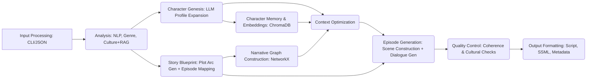

# Narrative-Core ✨

**Transforming ideas into rich, coherent, and culturally resonant multi-episode narratives using AI.**

[](license.md)
---

In a world demanding ever more engaging and immersive content, **Narrative-Core** stands as a revolutionary AI-driven storytelling system. It tackles the core challenges of AI narrative generation – maintaining coherence over long arcs, ensuring character consistency, managing complex context, and weaving in authentic cultural nuances.

Whether you start with a simple concept note or detailed specifications, Narrative-Core orchestrates a sophisticated pipeline to generate multi-episode scripts ready for the next stage of production.

## 🎯 The Challenge

Traditional storytelling faces hurdles when scaling with AI:

1.  **Narrative Coherence:** AI-generated stories often suffer from dropped plot points, inconsistent character behavior, lack of emotional depth, and shallow character development across episodes.
2.  **Cultural Relevance:** Generating content that resonates culturally requires more than surface-level references. It needs understanding of underlying patterns, themes, and sensitivities (e.g., Panchatantra frameworks, Ashtarasa emotional arcs).
3.  **Long-Form Narratives:** LLM context window limitations hinder the creation of truly expansive, multi-episode stories where past events and subtle character shifts remain crucial.

## 🚀 The Solution: Narrative-Core

Narrative-Core addresses these challenges with a modular, AI-powered pipeline featuring:

*   🧠 **Intelligent Input Processing:** Accepts concepts via interactive CLI or JSON. Uses NLP (spaCy/Transformers) for entity/theme extraction, classifies genre, and crucially, detects cultural context using **keyword analysis and RAG** against a dedicated cultural narratives vector store (ChromaDB).
*   🗺️ **Automated Story Blueprinting:** Generates structured plot arcs (e.g., Three-Act) based on the concept and maps them into logical episode outlines. Builds a **Narrative Knowledge Graph** (NetworkX prototype) to track entities (characters, locations, events) and their relationships.
*   🎭 **Deep Character System:** Moves beyond static descriptions. Includes:
    *   *Character Genesis:* LLM expands basic inputs into rich profiles (backstory, motivations, flaws, voice).
    *   *Semantic Memory:* Each character maintains memories stored and retrieved via vector embeddings (ChromaDB), considering relevance, recency, and importance.
    *   *Dynamic Relationships:* Tracks evolving relationships between characters based on interactions.
    *   *Consistent Dialogue:* Generates dialogue reflecting personality, current state, memories, and relationships using targeted LLM prompting.
*   📚 **Advanced Memory Management:** Tackles context limitations head-on:
    *   *Hierarchical Summarization:* Creates summaries at scene, episode, and potentially act levels.
    *   *Knowledge Graph Integration:* Leverages the structured narrative graph for contextual information.
    *   *Context Optimization:* Intelligently selects and ranks the most relevant information (character states, memories, KG context, summaries) to fit the LLM's token limit for each generation step.
*   🎬 **Multi-Episode Script Generation:** Constructs detailed scenes from outlines, generates character-specific dialogue, and assembles full episode scripts (.txt, .json).
*   ✅ **Automated Quality Control:** Employs LLM-based checks for:
    *   *Narrative Coherence:* Plot logic flow, character consistency across scenes/episodes, plot point resolution.
    *   *Cultural Validity & Sensitivity:* Validates representation against detected cultural context and flags potential issues based on sensitivity analysis.
*   🔊 **Flexible Output Formatting:** Adapts generated scripts into various formats, including plain text, structured JSON, **SSML for audio production**, and metadata (summaries, keywords, content warnings).

## 🏛️ Architecture Overview

Narrative-Core operates through a sequential pipeline, orchestrating specialized modules:



*(See `docs/architecture/Repository.md` and `run_pipeline.py` for more details)*

## 🛠️ Technology Stack

*   **Core:** Python 3.x, Asyncio
*   **AI/ML:**
    *   OpenAI API (GPT-4/GPT-3.5-turbo configurable via `.env`)
    *   Hugging Face Transformers (for local models - Genre, NLP)
    *   spaCy (for NLP)
    *   ChromaDB (for Vector Stores - RAG, Character Memory)
    *   Sentence-Transformers (Implicitly via ChromaDB or explicit embedding)
*   **Data & Structure:** Pydantic (Data Validation & Settings), PyYAML (Prompts)
*   **Graph:** NetworkX (for Knowledge Graph prototype)
*   **CLI:** Questionary, Typer
*   **Utilities:** Langchain (Potentially used implicitly or planned), Logging

## 🚀 Getting Started

1.  **Clone the Repository:**
    ```bash
    git clone https://github.com/krishnaag23/krishnaag23-narrative-core.git
    cd krishnaag23-narrative-core
    ```

2.  **Set up a Virtual Environment (Recommended):**
    ```bash
    python -m venv venv
    source venv/bin/activate  # On Windows use `venv\Scripts\activate`
    ```

3.  **Install Dependencies:**
    ```bash
    pip install -r requirements.txt
    # Download spaCy model if you haven't already
    python -m spacy download en_core_web_sm
    ```

4.  **Configure API Key:**
    *   Create a `.env` file in the project root (`krishnaag23-narrative-core/`).
    *   Add your OpenAI API key:
        ```env
        # .env
        OPENAI_API_KEY="sk-YOUR_API_KEY_HERE"
        # Optional: Override default LLM model
        # LLM_MODEL_NAME="gpt-4-turbo-preview"
        # Optional: Set log level (DEBUG, INFO, WARNING, ERROR)
        # LOG_LEVEL="INFO"
        ```

5.  **Populate RAG Database (IMPORTANT - Run Once):**
    This script populates the `cultural_narratives` collection in ChromaDB with examples needed for cultural context RAG.
    ```bash
    python scripts/populate_rag_db.py
    ```

6.  **Run the Pipeline:**
    Execute the main pipeline script using the sample input file:
    ```bash
    python run_pipeline.py --input-file sample_input.json
    ```
    *   Use `-i` or `--input-file` to specify a different input JSON.
    *   Use `-e` or `--episodes` to override the episode count derived from the input's `story_length`.

7.  **Check Outputs:**
    Generated files (story concept, character profiles, plot arc, episode outlines, scripts, quality report, metadata, graph visualization) will be saved in the `pipeline_output/` directory.

## 📝 Input & Output

*   **Input:** The pipeline currently takes a JSON file (see `sample_input.json`) detailing the initial concept, characters, setting, and plot ideas. An interactive CLI mode is also available via `scripts/generate_story.py` (though `run_pipeline.py` is the main entry point).
*   **Output:** Various files are generated in `pipeline_output/`, including:
    *   Processed `StoryConcept` JSON.
    *   Detailed `CharacterProfile` JSONs.
    *   `PlotArc` and `EpisodeOutlines` JSONs.
    *   Narrative Knowledge Graph visualization (`.png`) and data (`.gml`).
    *   Full Episode Script JSONs (`4_episode_X_script.json`).
    *   `QualityReport` JSON.
    *   Metadata JSON and Audio Format files (Text, SSML) for the first episode.

## 🧩 Core Modules (`src/`)

*   **`input_processing/`**: Handles user input, NLP analysis, genre classification, and cultural context detection (incl. RAG). Outputs `StoryConcept`.
*   **`character_system/`**: Manages character creation (Genesis), profiles, memory (vector store), relationships, and dialogue generation.
*   **`memory_management/`**: Focuses on storing, retrieving, and optimizing context across the narrative (KG, Summarization, Context Optimizer).
*   **`story_blueprint/`**: Generates the high-level plot structure (arc), maps it to episodes, and builds the narrative graph.
*   **`episode_generator/`**: Constructs scenes and builds full episode scripts, integrating dialogue generation.
*   **`quality_control/`**: Performs automated checks for coherence and cultural validity.
*   **`output_formatter/`**: Converts generated scripts into final formats (SSML, metadata).
*   **`utils/`**: Shared utilities (LLM Wrapper, Vector Store Interface, Prompt Manager, Config, Graph DB Interface).
*   **`config/`**: Contains configuration files and prompt templates (`prompts/*.yaml`).

## 📚 Documentation

Detailed documentation for specific components and architecture can be found in the `/docs` directory: It is WIP and will be updated with time.

*   `docs/architecture/`: High-level system design.
*   `docs/components/`: Documentation for utility modules.
*   `docs/character_system.md`: Overview of the character system.

## 🛣️ Future Work (Potential)

*   Integration with fine-tuned models for specific styles/genres.
*   More sophisticated Knowledge Graph reasoning.
*   UI/API interface for easier interaction.
*   Enhanced pacing control and cinematic output formats.
*   Direct integration with audio generation services.
*   More robust testing suite.


## 📜 License

This project is licensed under the MIT License - see the [LICENSE](license.md) file for details. 

## 🙏 Acknowledgements

*   Developed by [Vaibhav Gupta](https://github.com/kvaibhav23/), [Vaibhav Itauriya](https://github.com/vaibhav-itauriya), [Krishna Agrawal](https://github.com/krishnaag23/).
*   Utilizes the power of OpenAI's language models.
*   Leverages fantastic open-source libraries like ChromaDB, Hugging Face Transformers, spaCy, Pydantic, and NetworkX.

---
